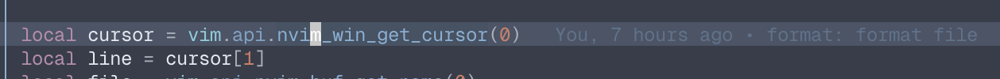
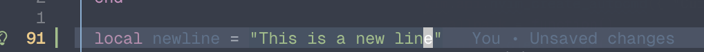
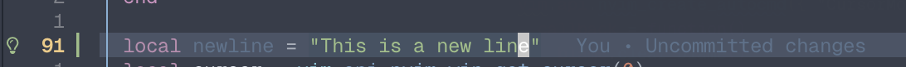

# inline-git-blame.nvim

VSCode-style inline git blame for Neovim, written in Lua.

Shows commit author, relative time, and commit message at the end of the current line, just like VSCode.
Handles unsaved and uncommitted changes, and only activates on normal files (not on explorer, help, etc).

---

## Screenshots





## Features

- Inline blame for the current line
- Shows: **Author, relative time, commit message**
- Displays "You" if the commit author matches your git user
- Handles unsaved and uncommitted changes gracefully
- Skips non-file buffers (NvimTree, Telescope, help, etc.)
- **Configurable:** Extend the list of excluded filetypes via `excluded_filetypes` option
- **Toggle:** Quickly show/hide blame annotation for the current line with a single function

---

## Installation

**lazy.nvim:**

Minimal:

```lua
return {
  "yt20chill/inline_git_blame.nvim",
  event = "BufReadPost",
  opts = {}
}
```

All settings:

```lua
-- plugins/inline_git_blame.nvim
return {
  "yt20chill/inline_git_blame.nvim",
  event = "BufReadPost",
  -- optional, default settings
  opts = {
    -- excluded_filetypes will be extended from default
    excluded_filetypes = { "NvimTree", "neo-tree", "TelescopePrompt", "help" },
    debounce_ms = 150,
    autocmd = true,
    you_label = "You", -- can be any string, or false to disable replacement
  },
  -- optional, default no keybindings because autocmds are preferred
keys = {
  { "<leader>gb", "<cmd>lua require('inline_git_blame').inline_blame_current_line()<CR>", desc = "Show inline git blame" },
  { "<leader>gB", "<cmd>lua require('inline_git_blame').clear_blame()<CR>", desc = "Clear inline git blame" },
  { "<leader>gt", "<cmd>lua require('inline_git_blame').toggle_blame_current_line()<CR>", desc = "Toggle inline git blame" },
},
}
```

**packer.nvim**

```lua
use {
  "yt20chill/inline_git_blame.nvim",
  event = "BufReadPost",
  config = function()
    require("inline_git_blame").setup({
      -- excluded_filetypes will be extended from default
      excluded_filetypes = { "NvimTree", "neo-tree", "TelescopePrompt", "help" },
      debounce_ms = 150,
      autocmd = true,
      you_label = "You", -- can be any string, or false to disable replacement
    })
  end,
  -- optional, default no keybindings because autocmds are preferred
  keys = {
    { "<leader>gb", function() require("inline_git_blame").inline_blame_current_line() end, desc = "Show inline git blame" },
    { "<leader>gB", function() require("inline_git_blame").clear_blame() end, desc = "Clear inline git blame" },
    { "<leader>gt", function() require("inline_git_blame").toggle_blame_current_line() end, desc = "Toggle inline git blame" },
  },
}
```

---

## Usage

### Out of the box

**No setup required!**  
By default, inline blame will appear automatically on `CursorHold` and clear on cursor move, thanks to the built-in autocmds.  
Just install and call:

```lua
require("inline_git_blame").setup()
```

You can also add keymaps if you want:

```lua
vim.keymap.set("n", "<leader>gb", require("inline_git_blame").inline_blame_current_line)
vim.keymap.set("n", "<leader>gB", require("inline_git_blame").clear_blame)
vim.keymap.set("n", "<leader>gt", require("inline_git_blame").toggle_blame_current_line)
```

---

### Toggle blame for the current line

You can use the toggle function to quickly show or hide the blame annotation for the current line:

```lua
require("inline_git_blame").toggle_blame_current_line()
```

Or map it to a key (as above):

```lua
vim.keymap.set("n", "<leader>gt", require("inline_git_blame").toggle_blame_current_line)
```

---

### Custom autocmds (optional)

If you want to set up autocmds yourself (for custom debounce or behavior), set `autocmd = false` in your config and use:

```lua
local blame = require("inline_git_blame")
local timer
vim.api.nvim_create_autocmd("CursorHold", {
  callback = function()
    if timer then timer:stop() timer:close() end
    timer = vim.loop.new_timer()
    timer:start(150, 0, vim.schedule_wrap(function()
      blame.inline_blame_current_line()
    end))
  end,
  desc = "Show inline git blame for current line (debounced)",
})

vim.api.nvim_create_autocmd({ "CursorMoved", "CursorMovedI" }, {
  callback = function()
    blame.clear_blame()
  end,
  desc = "Clear inline git blame on cursor move",
})
```

---

## Options

| Option               | Type           | Default                                                 | Description                                               |
| -------------------- | -------------- | ------------------------------------------------------- | --------------------------------------------------------- |
| `debounce_ms`        | `number`       | `150`                                                   | Debounce time for blame in ms                             |
| `excluded_filetypes` | `table`        | `{ "NvimTree", "neo-tree", "TelescopePrompt", "help" }` | Filetypes to exclude (your values are appended)           |
| `autocmd`            | `boolean`      | `true`                                                  | Whether to set up built-in autocmds                       |
| `you_label`          | `string/false` | `"You"`                                                 | Label to use for your own commits (or `false` to disable) |

---

## Requirements

- Neovim 0.8+
- git in your PATH
- Your files must be in a git repository

---

## TODO

- [x] Customizable file type to include or exclude
- [x] Toggle inline git blame
- [x] Customizable you label
- [x] Fix plural time

## License

MIT

---
